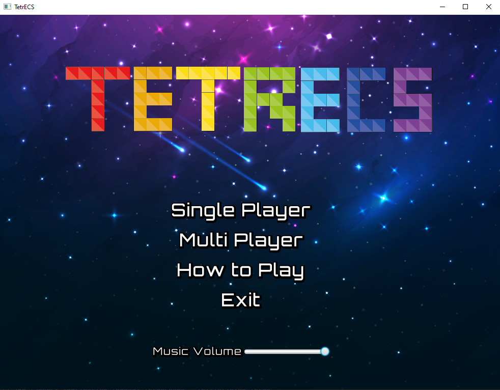

# Portfolio Project 
This project is a responsive personal portfolio website made from scratch using HTML, CSS and JavaScript.
 
## Table of Contents
* [Video](#video)
* [General Info](#general-information)
* [Technologies Used](#technologies-used)
* [Features](#features)
* [Setup](#setup)
* [Usage](#usage)
* [Project Status](#project-status)
* [Room for Improvement](#room-for-improvement)
* [Screen Shots](#screen-shots)
* [Acknowledgements](#acknowledgements)

## Video

https://user-images.githubusercontent.com/76476479/128232986-7d87e45a-c079-4bf4-872c-b78b195ddb51.mp4

## General Information
### Skills developed as a result of this project:
- Deploying a website to GitHub Pages
- HTML forms
- DOM events with JavaScript
- Responsive design
- Layouts with Flexbox 
- Web accessibility

## Technologies Used
- HTML
- CSS
- JavaScript
- Git version control
- Linux and file navigation

## Features
List the ready features here:
- Layout is responsive for mobile and tablets, with a nice mobile menu.
- Working HTML form in which an email is sent to me with the users input.
- Smooth scrolling and JavaScript highlighting.

## Usage

Visit [Aymen's Portfolio Website](https://aymen-adjali.github.io/portfolioProject/).

## Project Status
Project is: _in progress_ I will keep adding improvements and new projects.

## Room for Improvement

Room for improvement:
- Adding multiple pages for contact etc.
- Improving responsiveness. 
- Improving accessibility, for example making sure all class values are descriptive enough for a screen reader.

## Screen Shots

  

  

  

## Acknowledgements
- This project was inspired by [this full stack engineering career path](https://www.codecademy.com/learn/paths/full-stack-engineer-career-path).
